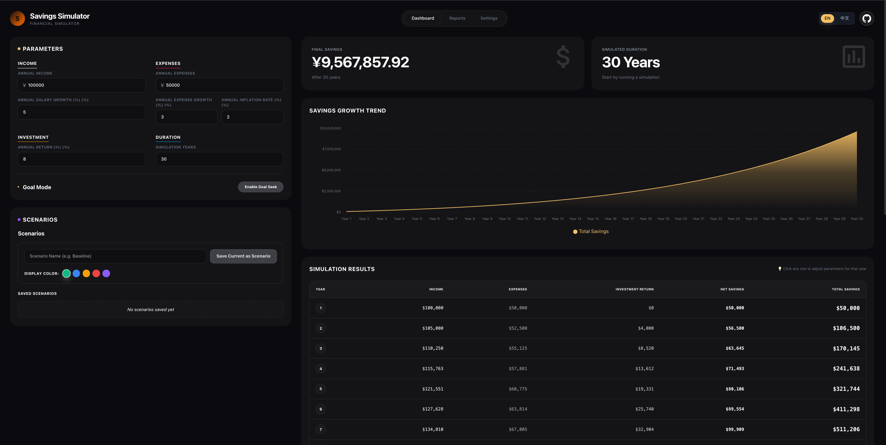

# 💰 Savings Simulator (积蓄模拟器)

A modern, interactive financial simulation tool designed to help users visualize their wealth growth over time. Built with the latest web technologies for a premium user experience.



## ✨ Features

- **Real-time Simulation**: Instantly see how changes in income, expenses, and investment returns affect your long-term savings. No clicks required.
- **Interactive Visualization**: Dynamic area charts showing total savings, net savings, and investment returns over time.
- **Bilingual Support (i18n)**: Full support for Chinese (Simplified) and English, with automatic browser language detection and preference persistence.
- **Yearly Overrides**: Granular control to adjust income or expenses for specific years (e.g., career milestones, major purchases).
- **Premium UI/UX**:
  - Glassmorphism design with backdrop blur effects.
  - Smooth entrance animations and hover interactions.
  - Responsive layout for all devices.
  - Dark mode optimized.
- **Data Privacy**: All calculations are performed locally in your browser.

## 🛠 Tech Stack

- **Framework**: [Next.js 16](https://nextjs.org/) (App Router)
- **Language**: [TypeScript 5](https://www.typescriptlang.org/)
- **Styling**: [Tailwind CSS v4](https://tailwindcss.com/)
- **UI Libraries**: [React 19](https://react.dev/)
- **Charts**: [Recharts](https://recharts.org/)

## 🚀 Getting Started

### Prerequisites

- Node.js 18+
- npm or pnpm

### Installation

1. Clone the repository:
   ```bash
   git clone https://github.com/DragonnZhang/savings-simulator.git
   cd savings-simulator
   ```

2. Install dependencies:
   ```bash
   npm install
   # or
   pnpm install
   ```

3. Run the development server:
   ```bash
   npm run dev
   # or
   pnpm dev
   ```

4. Open [http://localhost:3000](http://localhost:3000) with your browser.

## 📁 Project Structure

```bash
apps/web/
├── src/
│   ├── app/              # Next.js App Router pages and layouts
│   ├── components/       # Reusable UI components
│   │   ├── icons/        # SVG icons
│   │   ├── SimulationForm.tsx  # Reactive input form
│   │   ├── SavingsChart.tsx    # Visualization component
│   │   └── ...
│   └── ...
└── ...
```

## 🤝 Contributing

Contributions are welcome! Please feel free to submit a Pull Request.

## 📄 License

This project is licensed under the MIT License - see the LICENSE file for details.
